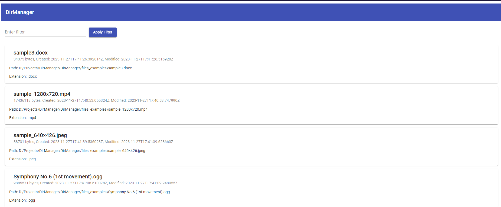
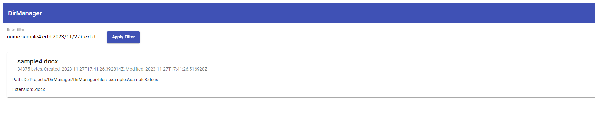
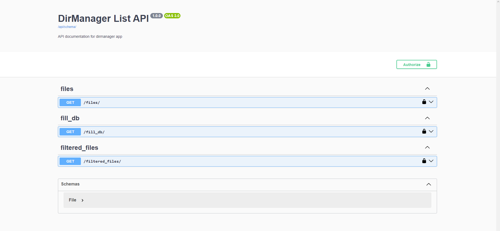
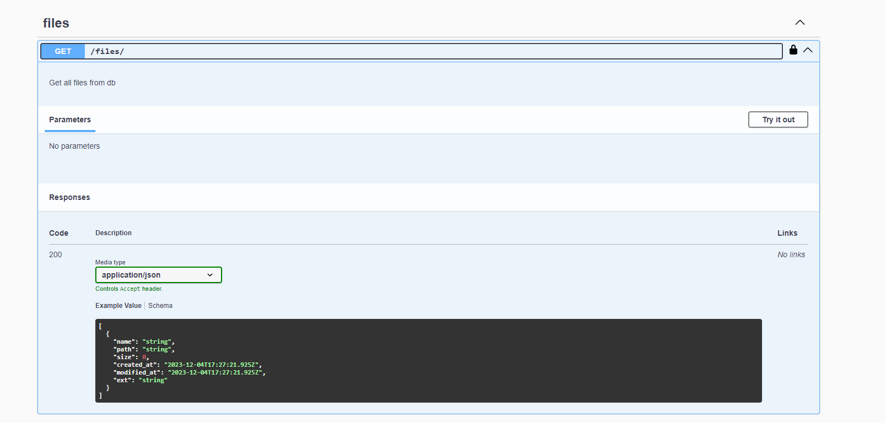
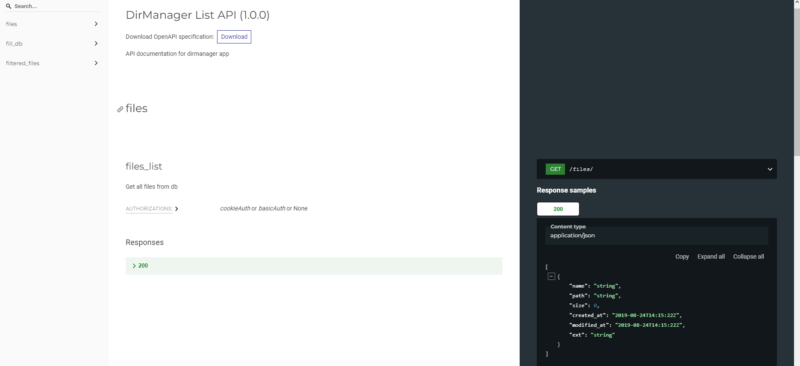

# DirManager
Данный проект представляет собой клиент-серверное приложение для получения списка файлов с возможностью фильтрации. Серверная часть написана на языке Python с использованием фреймворка Django, клиентская часть - на TypeScript с использованием фреймворка Angular версии 13. В качестве базы данных используется SQLite.

### Эндпойнты
 - /files/ - GET-запрос на получение списка всех файлов.
 - /filtered_files/ - POST-запрос на получение списка файлов с применением фильтра. В теле запроса передаются данные для фильтрации файлов.
 - /fill_db/ - GET-запрос на заполнение базы данных тестовыми данными.

Для просмотра схемы API необходимо перейти по ссылке /api/schema/. Для просмотра Swagger UI необходимо перейти по ссылке /api/schema/swagger-ui/. Для просмотра Redoc необходимо перейти по ссылке /api/schema/redoc/.

### Скриншот страницы с файлами:

### Скриншот страницы с фильтром:

### Скриншоты Swagger UI:

### Скриншот Redoc:

